<p align="center">
  <h1 align="center">⚡ Anomaly</h1>
  <p align="center">
    <strong>Integrated E-Commerce · Warehouse OS · Security XDR Platform</strong>
  </p>
  <p align="center">
    A modular monolith combining a full-featured marketplace (BoltMart), a warehouse management system (Warehouse OS),
    and an AI-powered security operations center (Sentinel XDR).
  </p>
</p>

<p align="center">
  
  
  
  
</p>

---

## 📋 Table of Contents

- [Architecture](#-architecture)
- [Modules](#-modules)
  - [BoltMart — E-Commerce Marketplace](#-boltmart--e-commerce-marketplace)
  - [Warehouse OS — Warehouse Management](#-warehouse-os--warehouse-management)
  - [Sentinel XDR — Security Operations](#-sentinel-xdr--security-operations)
- [Tech Stack](#️-tech-stack)
- [Quick Start](#-quick-start)
- [Project Structure](#-project-structure)

---

## 🏗 Architecture

```
┌─────────────────────────────────────────────────────────────┐
│                     Anomaly Platform                        │
│  ┌──────────────┐  ┌──────────────┐  ┌──────────────────┐  │
│  │   BoltMart    │  │  Warehouse   │  │   Sentinel XDR    │  │
│  │  (Marketplace)│  │    OS        │  │   (Security)      │  │
│  │  :5001        │  │  :5002       │  │   :5003           │  │
│  └──────┬───────┘  └──────┬───────┘  └────────┬─────────┘  │
│         │                 │                    │             │
│         └─────────────────┼────────────────────┘             │
│                           │                                  │
│                    ┌──────┴──────┐                          │
│                    │   Supabase   │                          │
│                    │  (Postgres)  │                          │
│                    └─────────────┘                          │
└─────────────────────────────────────────────────────────────┘
```

All three modules share a common **Supabase** backend via `shared/db_client.py`.  
**Sentinel XDR** ingests security events from both BoltMart and Warehouse OS.

---

## 📦 Modules

### 🛒 BoltMart — E-Commerce Marketplace

A full-stack e-commerce platform with user accounts, product catalog, shopping cart, 
Razorpay payments, wishlist, order tracking, and built-in fraud detection.

| | | |
|---|---|---|
| 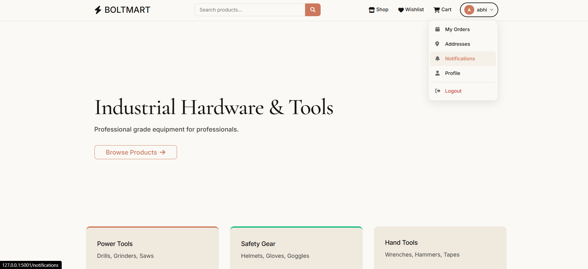 | 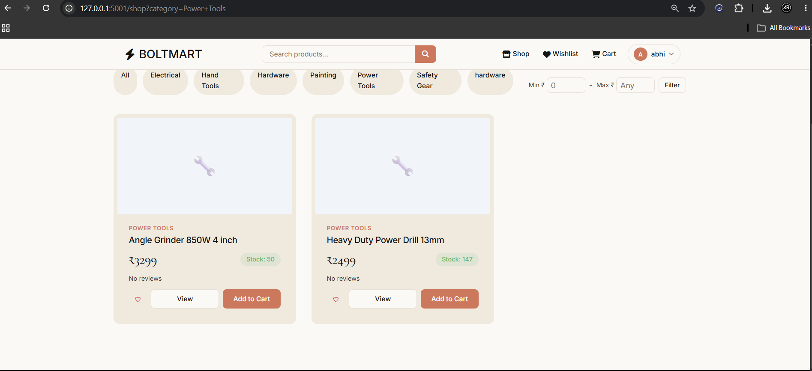 | 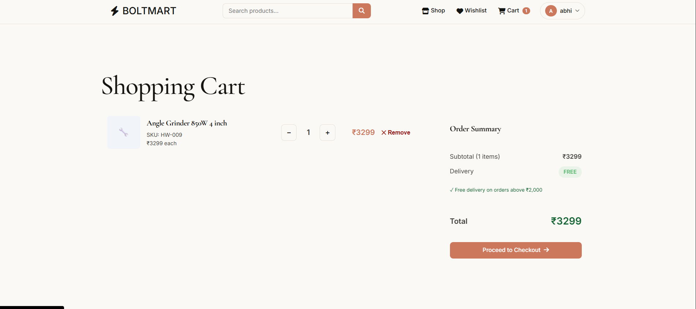 |
| **Home Page** | **Product Shop** | **Shopping Cart** |
| 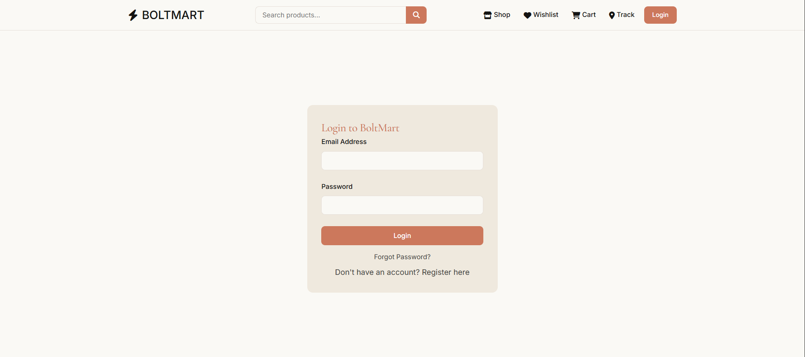 |  | 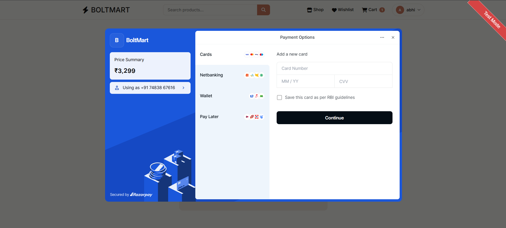 |
| **User Login** | **OTP Verification** | **Checkout & Payment** |
| 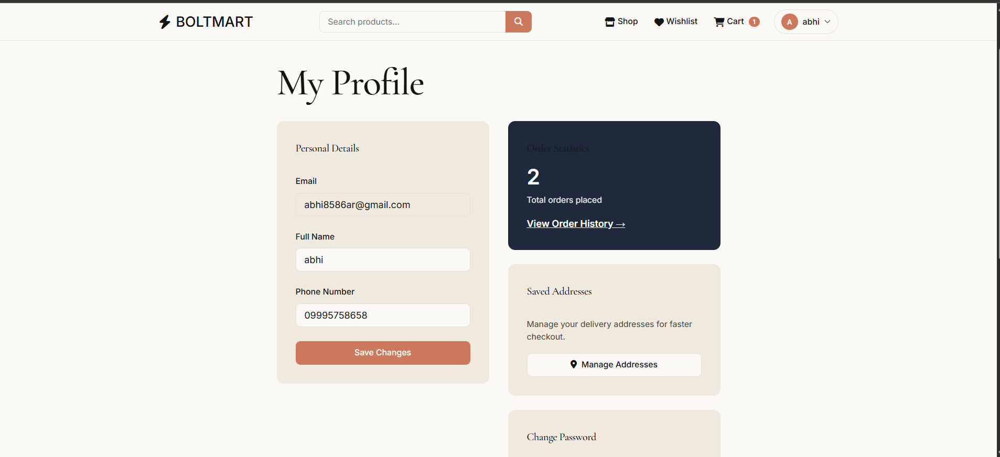 |  | 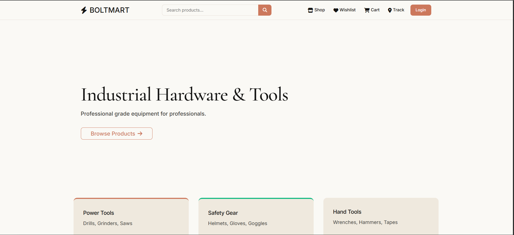 |
| **User Profile** | **My Orders** | **User Dashboard** |

**Key Features:**
- User registration, login, OTP verification, password reset
- Product catalog with search and categories
- Shopping cart and wishlist management
- Razorpay payment integration
- Order tracking and history
- **Anomaly detection** — flags repeated payment failures as potential fraud via Sentinel XDR
- Email notifications (welcome, order status, fraud alerts)

---

### 📦 Warehouse OS — Warehouse Management

Complete warehouse operations platform: inventory control, purchase orders, supplier 
management, stock receiving, fulfillment, returns, write-offs, and delivery tracking.

| | | |
|---|---|---|
| 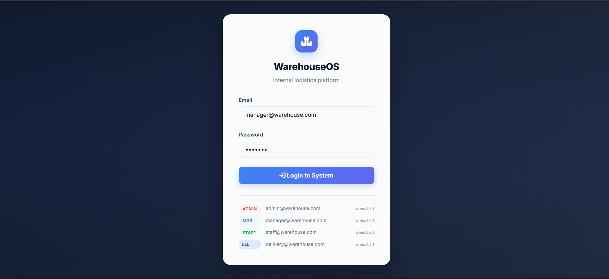 | 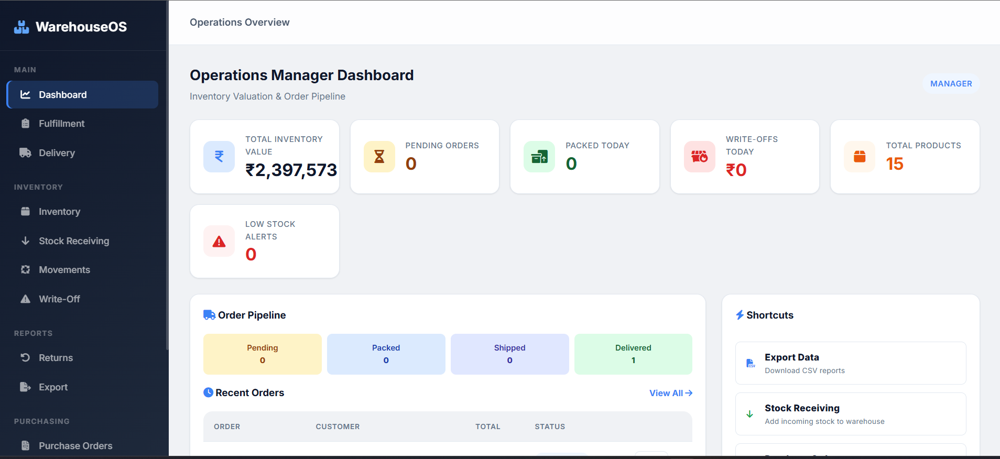 | 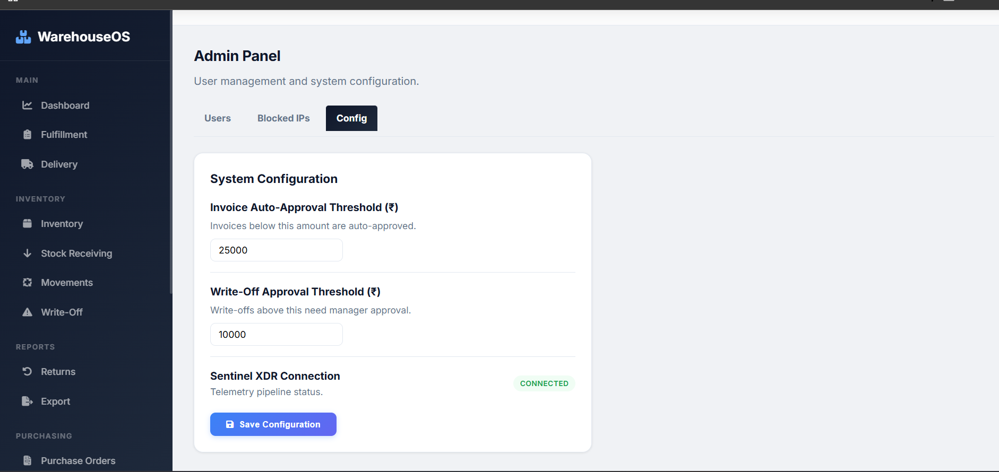 |
| **Warehouse Login** | **Dashboard** | **System Configuration** |
| 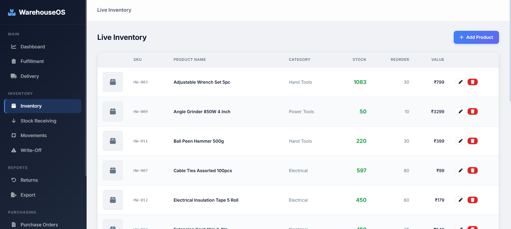 | 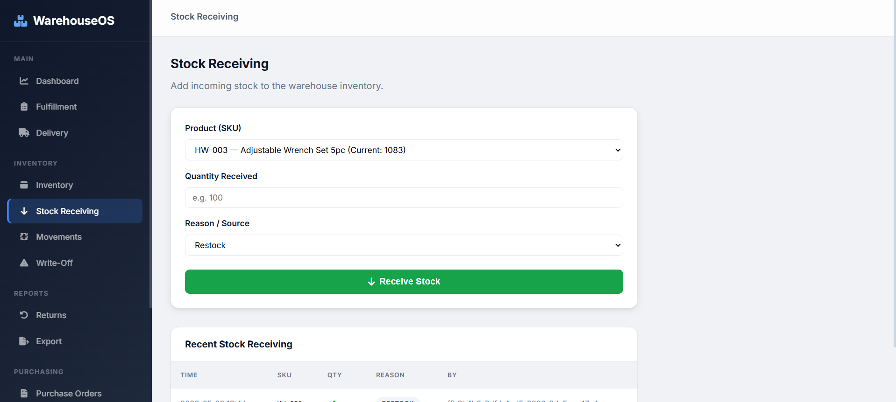 | 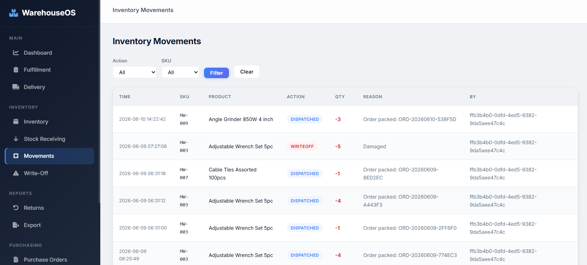 |
| **Inventory Management** | **Stock Receiving** | **Inventory Movements** |
| 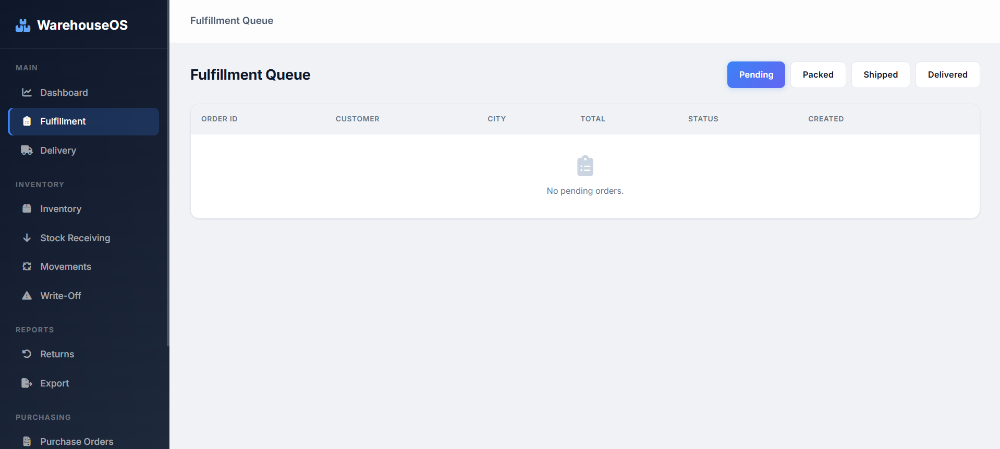 |  |  |
| **Order Fulfillment** | **Delivery Tracking** | **Returns & Replacements** |
|  | 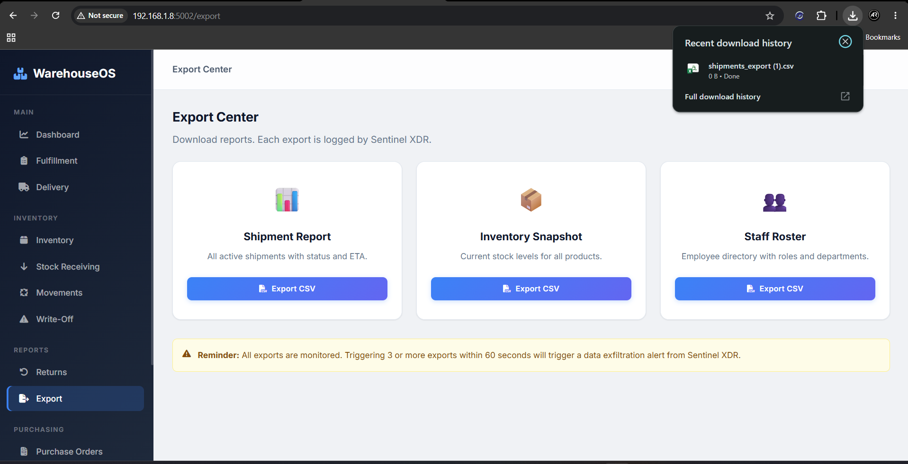 |  |
| **Supplier Management** | **Data Export** | **Inventory Write-offs** |
|  |  | |
| **Purchase Orders** | **Admin & Roles** | |

**Key Features:**
- Inventory tracking with stock levels and movements
- Purchase order management with discrepancy detection
- Supplier management (add, remove, rate)
- Stock receiving and put-away
- Order fulfillment and delivery tracking
- Returns and replacements processing
- Inventory write-offs
- Data export (CSV)
- Role-based access control

---

### 🛡 Sentinel XDR — Security Operations

An AI-powered extended detection and response platform with real-time log ingestion, 
ML-based anomaly detection, threat intelligence, MITRE ATT&CK mapping, 
incident management, and automated playbooks.

| | | |
|---|---|---|
| 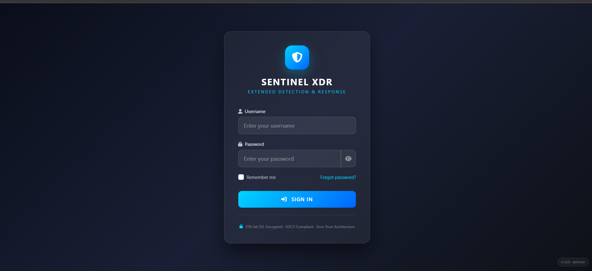 | 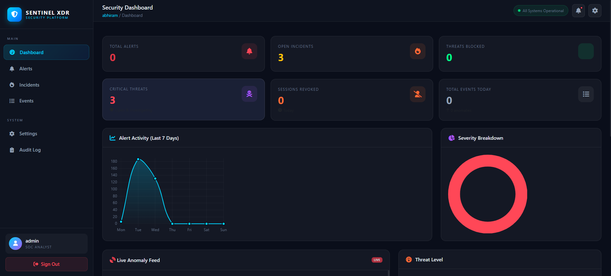 | 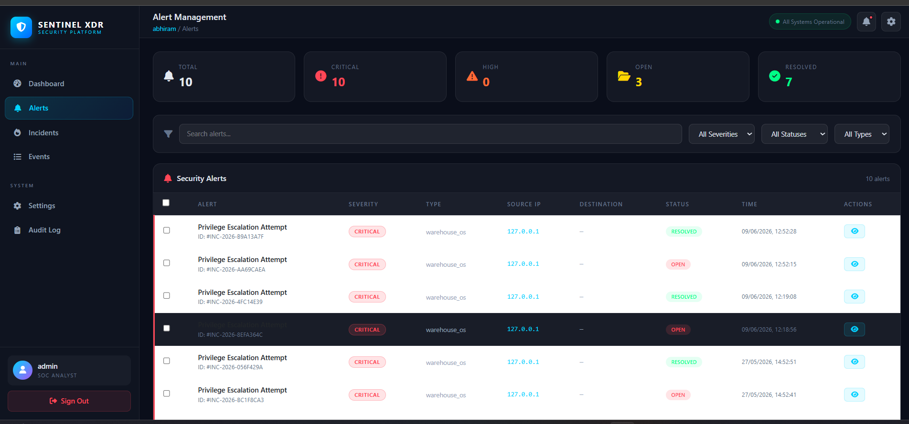 |
| **Sentinel Login** | **Security Dashboard** | **Alert Management** |
| 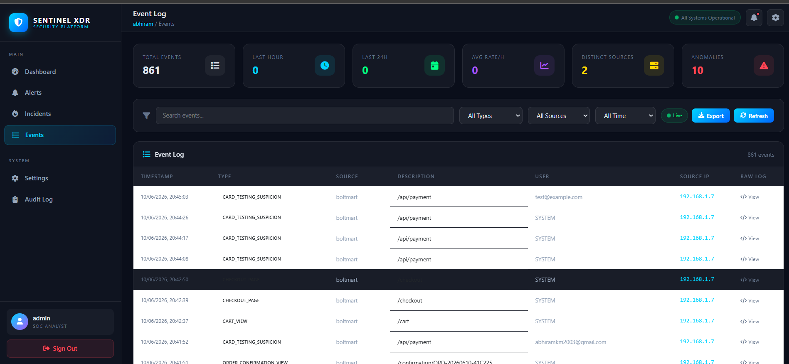 | 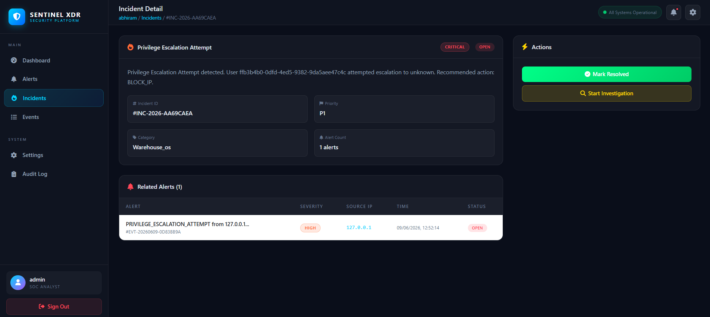 |  |
| **Event Viewer** | **Incident Response** | **IP Blocking Decisions** |
| 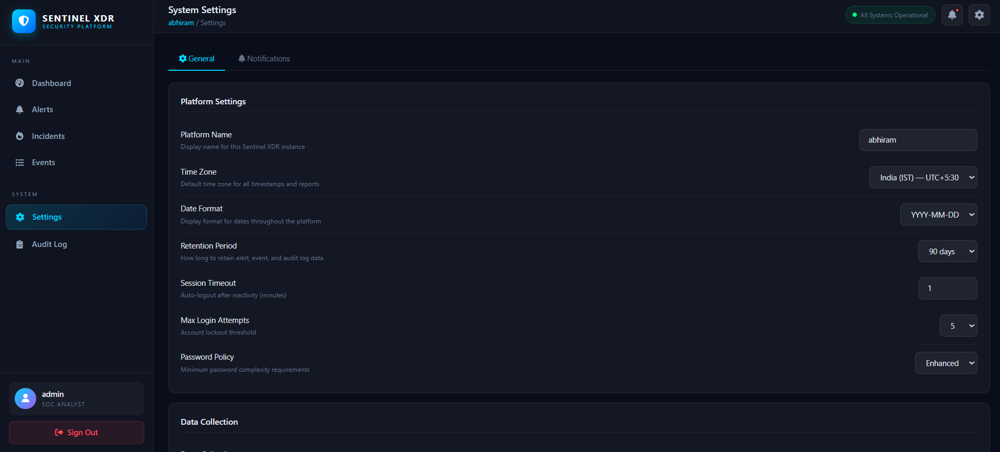 | | |
| **System Settings** | | |

**Key Features:**
- Real-time security event ingestion API
- **ML-based anomaly detection** (scikit-learn — Isolation Forest, One-Class SVM)
- MITRE ATT&CK framework mapping
- Threat intelligence feeds and IoC management
- Incident case management with response actions
- Automated playbooks and active response
- Asset inventory and vulnerability tracking
- Network traffic analysis
- Compliance reporting
- Audit logging
- LLM-powered security analysis (Groq integration)

---

## 🛠️ Tech Stack

| Category | Technology |
|---|---|
| **Backend** | Python 3.11+, Flask 3.0 |
| **Database** | Supabase (PostgreSQL) |
| **Cache / Queue** | Redis, RQ (job queue) |
| **Payments** | Razorpay |
| **Security / ML** | scikit-learn (Isolation Forest, One-Class SVM), Groq LLM |
| **PDF** | ReportLab |
| **Auth** | bcrypt, python-jose (JWT) |
| **Infrastructure** | Gunicorn, Eventlet |
| **Email** | SMTP (custom notifier) |

---

## 🚀 Quick Start

```bash
# 1. Clone the repository
git clone https://github.com/your-org/anomaly.git
cd anomaly

# 2. Create virtual environment
python -m venv .venv
.venv\Scripts\activate  # Windows
# source .venv/bin/activate  # Linux/Mac

# 3. Install dependencies
pip install -r requirements.txt

# 4. Configure environment
cp .env.example .env
# Edit .env with your Supabase credentials, Razorpay keys, etc.

# 5. Start the modules (each in a separate terminal)

# Terminal 1 — BoltMart (Marketplace)
python -m boltmart.app

# Terminal 2 — Warehouse OS
python -m warehouse_os.app

# Terminal 3 — Sentinel XDR (Security)
python -m sentinel_xdr.app
```

Each module runs on its own port (defaults: BoltMart `:5001`, Warehouse OS `:5002`, Sentinel XDR `:5003`).

---

## 📁 Project Structure

```
├── boltmart/            # E-Commerce marketplace
│   ├── templates/       # Jinja2 HTML templates
│   ├── static/          # CSS, JS
│   ├── app.py           # Flask application
│   ├── config.py        # Configuration
│   ├── anomaly.py       # Fraud detection client
│   ├── db_users.py      # User DB operations
│   ├── invoice.py       # PDF invoice generation
│   ├── notifier.py      # Email notifications
│   ├── seed.py          # Database seeding
│   └── sentinel.py      # Sentinel integration
├── warehouse_os/        # Warehouse management system
│   ├── templates/       # Jinja2 HTML templates
│   ├── static/          # CSS, product images
│   ├── app.py           # Flask application
│   ├── config.py        # Configuration
│   └── sentinel.py      # Sentinel integration
├── sentinel_xdr/        # Security XDR platform
│   ├── blueprints/      # Route blueprints (auth, alerts, incidents, etc.)
│   ├── templates/       # Jinja2 HTML templates
│   ├── app.py           # Flask application
│   ├── config.py        # Configuration
│   ├── anomaly_detector.py  # ML-based anomaly detection
│   ├── detection_rules.py   # Detection rule engine
│   ├── llm_analyzer.py      # LLM-powered analysis
│   └── worker.py            # Background worker
├── shared/              # Shared modules
│   ├── constants.py     # Shared constants
│   └── db_client.py     # Supabase client
├── img/                 # Screenshots
│   ├── admin/           # Sentinel XDR screenshots
│   ├── users/           # BoltMart screenshots
│   └── warehouse/       # Warehouse OS screenshots
├── requirements.txt     # Python dependencies
└── .env                 # Environment variables
```

---

<p align="center">
  Built with ❤️ using Flask & Supabase
</p>
